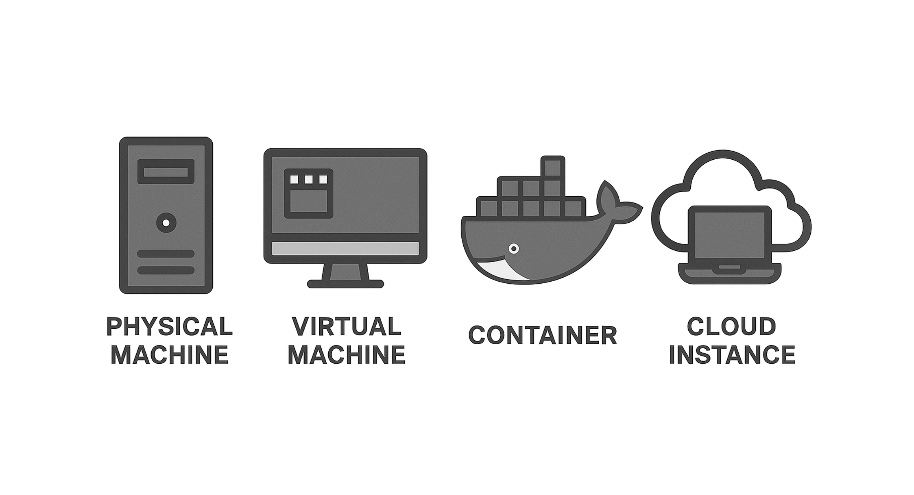

# Setup Guide
You can refer to the official documentation below for instructions on how to set up an **Astar Archive Node**.

* 🔗 [Archive Node](https://docs.astar.network/docs/build/nodes/archive-node/)

The Peers Program uses its own program-specific hardware requirements based on archive-node operation experience. These may differ from the general requirements shown in the official Astar documentation.

A node can be set up on a physical machine, virtual machine, container environment, or cloud instance. However, any setup other than a physical machine requires a significant amount of infrastructure-related technical knowledge.

For those who are not technical specialists, we recommend starting by preparing a **physical machine**.

## Docker

The configuration using Docker is documented in the official guide.  

* 🔗 [Dokcker](https://docs.astar.network/docs/build/nodes/archive-node/docker)

## Docker Compose

For reference, here is an example procedure for setting up an archive node using Docker Compose. 

* 🔗 [How to create an Archive Node with Docker compose.yml](https://github.com/jttech-au/Astar-Archive-Node) / Author: Dagga

# Astar Releases 

The release provides binaries for macOS x86_64, Ubuntu x86_64, and Linux ARM64 (aarch64).

* 🔗 [Latest Release](https://github.com/AstarNetwork/Astar/releases/latest)

# Additional Information
Before setting up, I’ll provide some supplementary notes to the official documentation.

### About Machine Specifications
* **As of July 2026**, the HDD currently in use occupies **2.1 TB**.
* Since blockchain data storage functions as a type of database, performance is just as important as capacity, and for physical machines, power consumption becomes an additional critical factor.
* Although SSDs are recommended, HDDs can also be used. However, HDDs require careful attention to power supply, and USB bus‑powered connections are not recommended.
* It is safer to have at least **8 GB of RAM**. There are cases where Raspberry Pi 4/5 with 4 GB RAM have operated successfully, but machines with 8 GB or more tend to be more stable.
